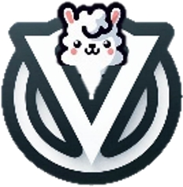
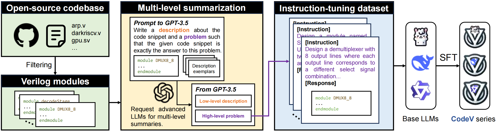

<div align="center">
   
</div>

# CodeV:Empowering LLMs for Verilog Generation through Multi-Level Summarization

 

CodeV is an innovative series of open-source, instruction-tuned Large Language Models (LLMs) specifically designed for the generation of high-quality Verilog code, addressing the challenges faced by existing models in this domain.  **(This repo is under development)** 

## Train and Fine-tuning

The training environment configuration and running methods refer to the [magicoder](https://github.com/ise-uiuc/magicoder) project.

## Test

If you want to test the generation capability of existing models on Verilog, you need to install the [VerilogEval](https://github.com/NVlabs/verilog-eval) and [RTLLM](https://github.com/hkust-zhiyao/rtllm) environments.

## Quick Start

```python
from transformers import pipeline
import torch
prompt= "FILL IN THE QUESTION"
generator = pipeline(
  model="CODEV",
  task="text-generation",
  torch_dtype=torch.bfloat16,
  device_map="auto",
)
result = generator(prompt , max_length=2048,num_return_sequences=1, temperature=0.0)
response = result[0]["generated_text"]
print("Response:", response)
```

## Models and Datasets

|      | Base Model                                                                                          | CodeV                                                               |
| ---- | --------------------------------------------------------------------------------------------------- | ------------------------------------------------------------------- |
| 6.7B | [deepseek-ai/deepseek-coder-6.7b-base](https://huggingface.co/deepseek-ai/deepseek-coder-6.7b-base) | [yang-z/CodeV-DS-6.7B](https://huggingface.co/yang-z/CodeV-DS-6.7B) |
| 7B   | [codellama/CodeLlama-7b-Python-hf](https://huggingface.co/codellama/CodeLlama-7b-Python-hf)         | [yang-z/CodeV-CL-7B](https://huggingface.co/yang-z/CodeV-CL-7B)     |
| 7B   | [Qwen/CodeQwen1.5-7B-Chat](https://huggingface.co/Qwen/CodeQwen1.5-7B-Chat)                         | [yang-z/CodeV-QW-7B](https://huggingface.co/yang-z/CodeV-QW-7B)     |

## 💻 LLM-generated Verilog code

We have collected existing LLMs of Verilog code and demonstrated their performance on VerilogEval and RTLLM in [Chip Design LLM Zoo](https://iprc-dip.github.io/AwesomeChipDesignLeaderBoard).

## Paper
**Arxiv:** <https://arxiv.org/abs/2407.10424>

Please cite the paper if you use the models from CodeV.

```
@misc{yang-z,
      title={CodeV: Empowering LLMs for Verilog Generation through Multi-Level Summarization}, 
      author={Yang Zhao and Di Huang and Chongxiao Li and Pengwei Jin and Ziyuan Nan and Tianyun Ma and Lei Qi and Yansong Pan and Zhenxing Zhang and Rui Zhang and Xishan Zhang and Zidong Du and Qi Guo and Xing Hu and Yunji Chen},
      year={2024},
      eprint={2407.10424},
      archivePrefix={arXiv},
      primaryClass={cs.PL},
      url={https://arxiv.org/abs/2407.10424}, 
}
```

## Acknowledgements

* [Magicoder](https://github.com/ise-uiuc/magicoder): Training code, original datasets and data decontamination
* [DeepSeek-Coder](https://github.com/deepseek-ai/DeepSeek-Coder): Base model for CodeV-DeepSeek
* [CodeLlama](https://ai.meta.com/research/publications/code-llama-open-foundation-models-for-code/): Base model for CodeLlama
* [CodeQwen](https://github.com/QwenLM/CodeQwen1.5): CodeV-CodeQwen 